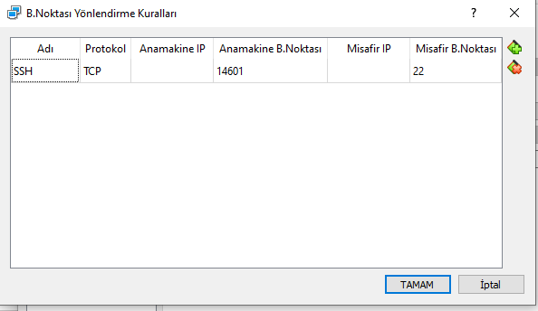
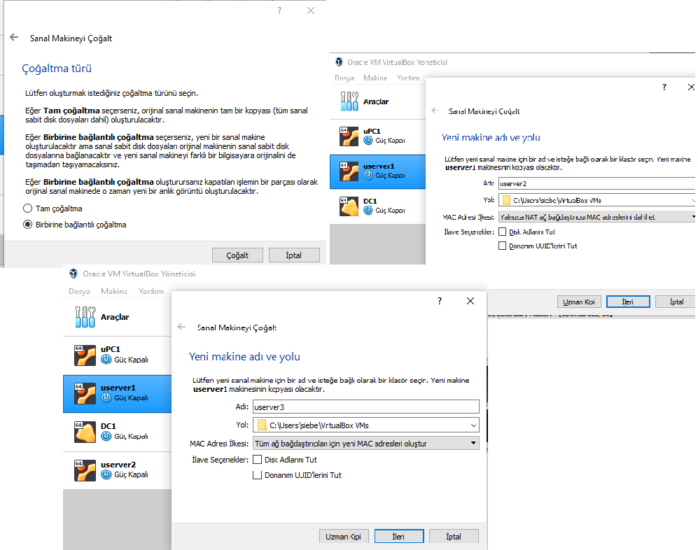

:blank: pass:[ +]
=        *Linux Ağ Yönetimi Final Projesi* 

#_Mahmut Yüncü 170202115_#

{blank}
{blank}
{blank}
{blank}
{blank} 
{blank}

== [underline]#Senaryo Bir#

*Aşama 1 : NAT ile Anamakine-Misafir Ubuntu Pc Bağlantısı*

* Kurulan Nat bağlantılı Ubuntu desktop (uPC1) için yeni bir bağlantı noktası kuralı belirtildi. Belirtilen kuralın Anamakine Bağlantı Noktası "14601" Misafir Bağlantı Noktası "22" olarak girildi.

* uPC1 için ifconfig in kullanılması için "sudo apt-get install net-tools" komutu ile net-tools ve ssh bağlantısı için "sudo apt install openssh-server" komutu ile ssh servisi yüklenildi.Yüklenme tamamlandıktan sonra "sudo service ssh start" komutu ile ssh servisi başlatıldı. Ardından "ifconfig" komutu komutu girilip upc1'in ip'si bulundu.

."ifconfig" komutunun sonucu
image::Senaryo1\1-1-1.PNG[]

* Host üzerinden "ssh localhost -p 14601 -l yuncu" komutu girilerel uPC1' e ssh bağlantısı sağlandı.

.SSH bağlantısı başarılı bir şekilde sağlandı
image::Senaryo1\1-1-2.PNG[]

* Host üzerinden uPC1' e "ping 10.0.2.15" komutu ile ping atılması denendi. 

.Ping denemesi başarısız olundu.
image::Senaryo1\1-1-3.PNG[]

* Host üzerinden bir dosyanın sanal makine olan upc1 e kopyalanması için öncelikle sanal makinenin aygıtlar -> paylaşılan pano ve aygıtlar -> sürükle bırak seçenekleri  çift yönlü olarak değiştirildi. Ardından uPC1 kapatılıp http://download.virtualbox.org/virtualbox/6.1.0/VBoxGuestAdditions_6.1.0 linkinden  "VBoxGuestAdditions_6.1.0.iso" dosyası indirilip upc1 e kuruldu. Kurulma işleminin ardından upc1 rebootlandı ve artık kopyalama işlemi yapılabilir.

.Host'tan Guest'e dosya kopyalama işlemi
image::Senaryo1\copytoGuest.gif[]

<<<

*Aşama 2 : TinyCore bağlantısı sağlanması*

* TinyCore kurulumu yapıldı ve bağdaştırıcı tipi Köprü Bağdaştırıcısı seçildi. 

image::Senaryo1\1-2-0.PNG[]

* TinyCore sistemine "tce-load -wi openssh.tcz" komutu ile ssh servisi indirildi. 

  

    cd /usr/local/etc/ssh

    sudo cp ssh_config.orig ssh_config

    sudo cp sshd_config.orig sshd_config

    echo "mahmut:"yenisifre | sudo chpasswd

    sudo echo "mahmut:"yenisifre | sudo chpasswd

    sudo /usr/local/etc/init.d/openssh start 
    

    
komutları sırası ile girilerek ssh servisi aktif hale getirildi.

image::Senaryo1\1-2-2.PNG[]

* TinyCore sisteminin ip adresi "ifconfig" komutu ile bulundu.

image::Senaryo1\1-2-3.PNG[]

* Host bilgisayardan TinyCore sistemine ssh bağlantısı yapıldı ve ping atıldı.

.SSH bağlantısı başarı ile sağlandı, Host üzerinden sanal makineye ping atılabildi
image::Senaryo1\1-2-4.PNG[]

*Aşama 3 : Yalnızca Anamakine Bağdaştırıcısı ile Host, Ubuntu server Bağlantısı* 

* Kurulumu yapılan serverin ip'si "ifconfig" komutu ile bulundu.

image::Senaryo1\1-3-1.PNG[]

* Bulunan ip adresine HOST üzerinden 

    ssh 192.168.50.181 -l yuncu
    
komutu girilerek HOST - server ssh bağlantısı yapıldı.

image::Senaryo1\1-3-2.PNG[]

* "ping 192.168.50.181" komut ile Host üzerinde servera ping atıldı.

image::Senaryo1\1-3-3.PNG[]

<<<

== [underline]#Senaryo İki#

*Dahili Ağ ile Serverlar arası ve Server-Host Bağlantısı*

Senaryo gereği elimizde üç adet server olması lazım bu yüzden serverlar klonlandı.

.Server 1 den server2 ve server3' ün klonlanması

* 3 serverında Bağdaştırıcı tipini DAhili Ağ olarak ayarlıyoruz.

{blank}

* Senaryo da bizden istenilene aşağıda verilen ip'lere göre her servera statik bir ip verelim:

    
    userver1 :192.168.1.5
    userver1 :192.168.1.6
    userver1 :192.168.1.7

* Ip adreslerini statik olarak belirlemek için serverların netplanlarının değiştirilmei gerekiyor bunun için aşağıdaki komutlar izlenildi.

    cat /etc/cloud/cloud.cfg.d/subiquity-disable-cloudinit-networking.cfg

#netplan dosyasının editi yapıldı    

    sudo vi /etc/netplan/00-installer-config.yaml
    
#yapılan plan server a uygulandı
    
    sudo netplan apply

* Yapılan adımlardan bazı görseller aşağıda verilmiştir

image::Senaryo2\2-1-3.PNG[caption="Şekil 2. "]

.netplan editi
image::Senaryo2\2-1-4.PNG[caption="Şekil 3. "]

.Değiştirilen ip 
image::Senaryo2\2-1-5.PNG[caption="Şekil 4. "]

.Ornek 2
image::Senaryo2\2-1-7.PNG[caption="Şekil 5. "]

* Dahili ağda olan bu üç serverın kendi aralarında ssh bağlantısı yapabildiği ve ping atabildikleri gösterilmiştir.

.userver1'den userver2 ye ssh bağlantısı ve ping
image::Senaryo2\sv1tosv2.PNG[caption="Şekil 6. "]

.userver1'den userver3 e ssh bağlantısı ve ping
image::Senaryo2\sv1tosv3.PNG[caption="Şekil 7. "]

.userver2'den userver1 e ssh bağlantısı ve ping
image::Senaryo2\sv2tosv1.PNG[caption="Şekil 8. "]

.userver2'den userver3 e ssh bağlantısı ve ping
image::Senaryo2\sv2tosv3.PNG[caption="Şekil 9. "]

.userver3'ten userver1 e ssh bağlantısı ve ping
image::Senaryo2\sv3tosv1.PNG[caption="Şekil 10. "]

.userver3'ten userver2' ye ssh bağlantısı ve ping
image::Senaryo2\sv3tosv2.PNG[caption="Şekil 11. "]

* Dahili ağdaki serverlar biribirleriyle iletişim kurabilse de host için durum aynı değildir. Host, dahili ağdaki serverlar ile ssh bağlantısı kuramaz.

.Host -> userver1/userver2/userver3 ssh bağlantısı
image::Senaryo2\2-2-16.PNG[caption="Şekil 12. "]

* Aynı şekilde Host serverlara ping te atamaz.

.Host -> userver1/userver2/userver3 ping
image::Senaryo2\2-2-17.PNG[caption="Şekil 13. "]

* Senaryoda userver1 ve userver2 arasında dosya transferi istenilmektedir. Bunun için sftp den yararlanılmıştır. Aşağıda ki komutlar istenilen dosyaları server1de yaratmak için sırası ile uygulanmıştır.

    cat > 170202115.txt
    cat > mahmut.txt
    cat > yuncu.txt
    
*SFTP bağlantısı ve dosyaları yollamak için
    
    sftp yuncu@192.168.1.6
    put  /home/yuncu/mahmut.txt /home/yuncu
    put  /home/yuncu/yuncu.txt /home/yuncu
    put  /home/yuncu/170202115.txt /home/yuncu
    
.SFTP ile userver1'den userver2'ye dosya transferi
image::Senaryo2\2-3-1.PNG[caption="Şekil 14. "]

<<<

== [underline]#Senaryo Üç#

* Senaryo üç gereği upc1, upc2, userver1 ve userver3 ün ağ ayarları aşağıda ki gbi değiştirilmiştir.

.uPC1 ve uPC2 Ağ Ayarları
image::Senaryo3\pc1pc2.PNG[caption="Şekil 1. "]

{blank}

.userver1 ve userver2 Ağ Ayarları
image::Senaryo3\sv1sv2.PNG[caption="Şekil 2. "]

<<<

*Network Şeması*

dahili1 +
uPc1 NAT, dahili 192.162.1.9 +
userver1 NAT, dahili 192.168.1.5 +
userver2 NAT, dahili 192.168.1.6 +

dahili2 +
uPc2 NAT, dahili 192.162.1.10 +
userver1 NAT, dahili 192.168.1.5 +
userver2 NAT, dahili 192.168.1.6

.uPc1 statik ip verildi
image::Senaryo3\1.PNG[caption="Şekil 3. "]

.Ubuntu Server1 ip
image::Senaryo3\sv1ip.PNG[caption="Şekil 4. "]

.Ubuntu Server2 ip
image::Senaryo3\sv2ip.PNG[caption="Şekil 5. "]

{blank}
{blank}
{blank}

* traceroute komutu sonuçları

.uPC1 -> uPC2
image::Senaryo3\upc1upc2.PNG[caption="Şekil 6. "]

.uPC1 -> Server1
image::Senaryo3\upc1sv1.PNG[caption="Şekil 7. "]

.uPC1 -> Server2
image::Senaryo3\upc1sv2.PNG[caption="Şekil 8. "]

== [underline]#Senaryo Üç Yeni#

{blank}
{blank}

* Senaryo üç gereği upc1, upc2, userver1 ve userver3 ün ağ ayarları aşağıda ki gbi değiştirilmiştir.

.uPC1 ve uPC2 Ağ Ayarları
image::Senaryo3Yeni\1pc1pc2.PNG[caption="Şekil 1. "]

.userver1 Ağ Ayarları
image::Senaryo3Yeni\1server1ag.PNG[caption="Şekil 2. "]

.userver2 Ağ Ayarları
image::Senaryo3Yeni\1server2ag.PNG[caption="Şekil 3. "]

* Serverlara quagga yüklenmesi için aşağıdaki komutlar girildi.Öncelikle root moduna geçildi.

    sudo su
    apt-get update
    apt-get install quagga quagga-doc

*  Ardından gerekli olan kütüphaneler iki server için de indirildi. İnidirilen kütüphane içersindeki quagga/daemons dosyası için gerekli ayarları tanımlamak için dosyayı nano formatında açıyoruz.

    nano /etc/quagga/daemons

* Dosyalar açıldığında gerekli eklemeleri yapıyoruz.

.userver1 Daemons config ayarları
image::Senaryo3Yeni\2daemonsSv1.PNG[caption="Şekil 4. "]

.userver2 Daemons config ayarları
image::Senaryo3Yeni\2daemonsSv2.PNG[caption="Şekil 5. "]

* Router yapılan serverlar için enp0s8 ve enp0s9 donanımlarının ayarları
yapıldı.

    cp /usr/share/doc/quagga-core/examples/zebra.conf.sample /etc/quagga/zebra.conf
cp /usr/share/doc/quagga-core/examples/ospfd.conf.sample /etc/quagga/ospfd.conf
sed -i s'/zebra=no/zebra=yes/' /etc/quagga/daemons
sed -i s'/ospfd=no/ospfd=yes/' /etc/quagga/daemons
echo 'VTYSH_PAGER=more' >>/etc/environment 
echo 'export VTYSH_PAGER=more' >>/etc/bash.bashrc
cat >> /etc/quagga/ospfd.conf << EOF
interface enp0s8
interface enp0s9
interface lo
router ospf
 passive-interface enp0s8
 network 192.168.1.0/24 area 0.0.0.0
 network 192.168.100.0/24 area 0.0.0.0
line vty
EOF
cat >> /etc/quagga/zebra.conf << EOF
interface enp0s8
 ip address 192.168.1.254/24
 ipv6 nd suppress-ra
interface enp0s9
 ip address 192.168.100.1/24
 ipv6 nd suppress-ra
interface lo
ip forwarding
line vty
EOF

.userver1-router için ip ayarları
image::Senaryo3Yeni\2quaggaInstlSv1.PNG[caption="Şekil 6. "]

 cp /usr/share/doc/quagga-core/examples/zebra.conf.sample /etc/quagga/zebra.conf
cp /usr/share/doc/quagga-core/examples/ospfd.conf.sample /etc/quagga/ospfd.conf
sed -i s'/zebra=no/zebra=yes/' /etc/quagga/daemons
sed -i s'/ospfd=no/ospfd=yes/' /etc/quagga/daemons
echo 'VTYSH_PAGER=more' >>/etc/environment 
echo 'export VTYSH_PAGER=more' >>/etc/bash.bashrc
cat >> /etc/quagga/ospfd.conf << EOF
interface enp0s8
interface enp0s9
interface lo
router ospf
 passive-interface enp0s8
 network 192.168.2.0/24 area 0.0.0.0
 network 192.168.100.0/24 area 0.0.0.0
line vty
EOF
cat >> /etc/quagga/zebra.conf << EOF
interface enp0s8
 ip address 192.168.2.254/24
 ipv6 nd suppress-ra
interface enp0s9
 ip address 192.168.100.2/24
 ipv6 nd suppress-ra
interface lo
ip forwarding
line vty
EOF

.userver2-router için ip ayarları
image::Senaryo3Yeni\2quaggaInstlSv2.PNG[caption="Şekil 7. "]

* Aşağıdaki komut ile Ipv4 forwarding aktif hale getirildi ;

    sysctl -w net.ipv4.ip_forward=1

.userver1
image::Senaryo3Yeni\2ipForwardSv1.PNG[caption="Şekil 8. "]    
    
.userver2
image::Senaryo3Yeni\2ipForwardSv2.PNG[caption="Şekil 9. "]   

* Zebra servisi serverlar için aktif hale getirildi.

    sudo /etc/init.d/zebra start

.userver1
image::Senaryo3Yeni\2quaggaStartSv1.PNG[caption="Şekil 10. "]    
    
.userver2
image::Senaryo3Yeni\2quaggaStartSv2.PNG[caption="Şekil 11. "]

<<<

.userver1 - userver2 enp0s9 donanımı üzerinden ping
image::Senaryo3Yeni\3enp0s9sv1sv2ping.PNG[caption="Şekil 12. "]

* quagga kurulumundan sonra değişmiş olan ipler

.userver1
image::Senaryo3Yeni\3sv1ip.PNG[caption="Şekil 13. "]

.userver2
image::Senaryo3Yeni\3sv2ip.PNG[caption="Şekil 14. "]

* PC1 ve PC2 için statik ip tanımlaması yeni bir netplan tanımlanarak, gedit ile de düzenlenilerek yapıldı.

    sudo gedit /etc/netplan/50-cloud-init.yaml

*Açılan yaml dosyasına aşağıdaki network ayarları atıldı.

    network:
  version: 2
  ethernets:
    enp0s3:
      dhcp4: yes
    enp0s8:
      dhcp4: no
      addresses: [192.168.1.1/24]
      gateway4:  192.168.1.254
      nameservers:
        addresses: [208.67.222.222, 208.67.220.220]

.upc1
image::Senaryo3Yeni\4pc1ipSet.PNG[caption="Şekil 15. "]

    network:
  version: 2
  ethernets:
    enp0s3:
      dhcp4: yes
    enp0s8:
      dhcp4: no
      addresses: [192.168.2.1/24]
      gateway4:  192.168.2.254
      nameservers:
        addresses: [208.67.222.222, 208.67.220.220]

.upc2
image::Senaryo3Yeni\4pc2ipSet.PNG[caption="Şekil 16. "]

* pclere route adresleri eklendi

    sudo ip route add 192.168.0.0/16 via 192.168.1.254 dev enp0s8

.upc1
image::Senaryo3Yeni\5routeAddpc1.PNG[caption="Şekil 17. "]

    sudo ip route add 192.168.0.0/16 via 192.168.2.254 dev enp0s8

.upc2
image::Senaryo3Yeni\5routeAddpc2.PNG[caption="Şekil 18. "]

* Verilen statik ip başarıyla eklenmiş mi kontrol edilir.

.upc1 if -c a sonucu
image::Senaryo3Yeni\6ipPc1.PNG[caption="Şekil 19. "]

.upc2 if -c a sonucu
image::Senaryo3Yeni\6ipPc2.PNG[caption="Şekil 20. "]

* Şu anda bütün kurulum işlemleri tamamlanmıştır.

.pc1 den pc2, server1 ve server2 ye ping atıldı
image::Senaryo3Yeni\7pc1toall.PNG[caption="Şekil 21. "]

* "traceroute" komutu sonuçları

 traceroute 192.168.1.254

.pc1 -> server1(enp0s8) 
image::Senaryo3Yeni\8traceroutepc1tosv1.PNG[caption="Şekil 22. "]

    traceroute 192.168.2.254

.pc1 -> server2(enp0s8) 
image::Senaryo3Yeni\8traceroutepc1tosv2.PNG[caption="Şekil 23. "]

    traceroute 192.168.100.2

.pc1 -> server2(enp0s9) 
image::Senaryo3Yeni\8traceroutepc1tosv22.PNG[caption="Şekil 24. "]

    traceroute 192.168.2.1

.pc1 -> pc2 
image::Senaryo3Yeni\8traceroutepc1topc2.PNG[caption="Şekil 25. "]

=== Senaryo Üç Network Diyagramı

.networkDiagram
image::Senaryo3Yeni\9networkDiagram.PNG[caption="Şekil 26. "]

=== IP Tablosu

.ip table
image::Senaryo3Yeni\ipTablosu.PNG[caption="Şekil 27. "]